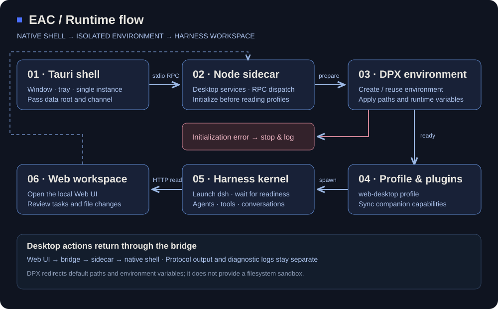

<div align="center">

<h1></h1>

**_EAC = Embracing All Creation（揽尽万象）_**

[中文](README.md) | [English](README.en.md)

[](https://github.com/DSH-EAC/EAC-Desktop)
[](LICENSE)

[](https://qm.qq.com/q/vqXxQQ3rmo)
[](https://discord.com/invite/kY48Ah8h)

[](https://trendshift.io/repositories/158075)
[](https://trendshift.io/repositories/158075)

[Download](https://github.com/DSH-EAC/EAC-Desktop/releases) · [Quick start](#quick-start) · [Architecture](#architecture) · [Community](#community-and-support)

</div>

**Turn agent capabilities into a desktop built for real work.**

Deepseek Harness EAC is an open-source desktop workspace built on [DeepSeek Harness](https://github.com/deepseek-ai/deepseek-harness). It brings conversations, project files, tool execution and extensions together, with native windows, separate runtime environments and bundled dependencies to get you from installation to work.

**EAC · Embracing All Creation.** Open capabilities, clear boundaries: the shell owns the desktop experience, the service layer owns orchestration, Harness owns the agent, and extension packages open up new possibilities.

<p align="center"><br /><sub>Skin showcase · appearance depends on the installed skin.</sub></p>

## Contents

- [Capabilities](#capabilities)
- [Quick start](#quick-start)
- [Architecture](#architecture)
- [Plugins and appearance](#plugins-and-appearance)
- [Data and environments](#data-and-environments)
- [Development](#development)
- [Documentation and community](#documentation-and-community)
- [Community and support](#community-and-support)
- [Contributors and acknowledgements](#contributors-and-acknowledgements)
- [License and acknowledgements](#license-and-acknowledgements)
- [Star history](#star-history)

## Capabilities

| From intent to action | What EAC provides |
| --- | --- |
| Start working | Bundled Node.js, npm and dsh resources launch the local Web UI without a separate Node installation |
| Collaborate around a project | Run tasks in a workspace, inspect session file changes, and review or restore edits through the file view |
| Manage long conversations | Request-path context compaction and bounded overflow recovery manage context space |
| Shape your workflow | Quick-setup controls for vision models and persona-related settings |
| Keep extensions manageable | Aggregated catalogs, installation and activation controls, plus protection-center snapshots, health checks and rollback |
| Separate environments | DPX manages environment identity, default data paths and runtime variables by release channel |
| Work as a desktop app | Tauri native windows, tray, single-instance behavior and exit policies with managed service lifecycles |
| Customize appearance | User skins arrive through market packages and integrate through explicit host contracts |

Model requests use your configured provider. Activation, compatibility and additional dependencies depend on the distribution package and extension configuration.

## Quick start

### Download and launch

Latest stable Windows release: **v6.0.0**. Other platforms link to the most recent published package for each listed format.

| Platform | Version | Download | Updated (UTC+8) |
| --- | --- | --- | --- |
| Windows x64 | v6.0.0 | [Full Setup](https://github.com/DSH-EAC/EAC-Desktop/releases/download/v6.0.0/Deepseek-Harness-EAC-full-v6.0.0-Setup-x64.exe) | 2026-10-05 02:23 |
| Windows x64 | v6.0.0 | [Full Portable](https://github.com/DSH-EAC/EAC-Desktop/releases/download/v6.0.0/Deepseek-Harness-EAC-full-v6.0.0-x64-portable.zip) | 2026-10-05 02:23 |
| Windows x64 | v6.0.0 | [Lite Setup](https://github.com/DSH-EAC/EAC-Desktop/releases/download/v6.0.0/Deepseek-Harness-EAC-lite-v6.0.0-Setup-x64.exe) | 2026-10-05 00:49 |
| Windows x64 | v6.0.0 | [Lite Portable](https://github.com/DSH-EAC/EAC-Desktop/releases/download/v6.0.0/Deepseek-Harness-EAC-lite-v6.0.0-x64-portable.zip) | 2026-10-05 00:49 |
| Linux x64 | v5.3.6 | [AppImage](https://github.com/DSH-EAC/EAC-Desktop/releases/download/v5.3.6/Deepseek.Harness.EAC_5.3.6_amd64.AppImage) | 2026-09-03 19:30 |
| Linux x64 | v5.3.6 | [deb](https://github.com/DSH-EAC/EAC-Desktop/releases/download/v5.3.6/Deepseek.Harness.EAC_5.3.6_amd64.deb) | 2026-09-03 19:30 |
| Linux x64 | v4.4.0-linux | [rpm](https://github.com/DSH-EAC/EAC-Desktop/releases/download/v4.4.0-linux/Deepseek-Harness-EAC-4.4.0.x86_64.rpm) | 2026-08-19 19:13 |
| macOS arm64 | v5.1.0 | [dmg](https://github.com/DSH-EAC/EAC-Desktop/releases/download/v5.1.0/Deepseek.Harness.EAC_5.1.0_macos-arm64.dmg) | 2026-08-27 15:12 |
| macOS arm64 | v5.1.0 | [app.zip](https://github.com/DSH-EAC/EAC-Desktop/releases/download/v5.1.0/Deepseek.Harness.EAC_5.1.0_macos-arm64.app.zip) | 2026-08-27 15:12 |

[Release notes](https://github.com/DSH-EAC/EAC-Desktop/releases/tag/v6.0.0) · [SHA256SUMS.txt](https://github.com/DSH-EAC/EAC-Desktop/releases/download/v6.0.0/SHA256SUMS.txt)

Update times are GitHub asset update timestamps. Platform packages may belong to different release generations; consult their release notes before installation. Windows uses WebView2; cloud models require network access and provider credentials.

1. **Launch the application** and wait for the local dsh service and Web UI.
2. **Configure your model**, including provider and API key.
3. **Select a workspace**, describe a task, and let the agent work in project context.
4. **Review the result** through conversation output and file-change views.
5. **Extend as needed** with plugins suited to your workflow.

<details>
<summary>Verify a download</summary>

Compute the file hash in PowerShell and compare it with the checksum manifest from the same release:

```powershell
Get-FileHash -LiteralPath '<downloaded-file-path>' -Algorithm SHA256
```

</details>

## Architecture

**One desktop entry point. Three distinct responsibilities.** EAC separates operating-system integration, runtime orchestration and the agent kernel so that desktop experience and extensions can evolve independently.



| Layer | Responsibility | Entry point |
| --- | --- | --- |
| **L1 · Native desktop** | Windows, tray, single instance, exit policy and native integration | [Rust shell](tauri-shell/src/main.rs) |
| **L2 · Orchestration** | Environment initialization, profiles, process startup, desktop RPC, plugin synchronization and management | [Node sidecar](tauri-shell/sidecar/server.ts), [desktop services](dsh-desktop/lib/desktop) |
| **L3 · Harness kernel** | Agent execution, conversations, tools, Cordis plugin tree and Web UI | [Kernel dependencies](dsh-desktop/package.json) |
| **DPX · Environment infrastructure** | Registration, directory layout, default paths and runtime variables | [Environment adapter](dsh-desktop/lib/desktop/environment.ts), [dsh-dpx](third_party/dsh-dpx) |

### From launch to execution

1. **The shell locates resources and starts the sidecar**, passing the product data root and channel.
2. **DPX creates or reuses an environment**, applying runtime variables before user configuration and plugin modules are read.
3. **The service layer prepares the profile and companion plugins**, launches dsh, and waits for readiness.
4. **The main window opens the Web UI**. Harness handles conversations and tool execution; desktop operations reach the host through the bridge.

Rust and Node communicate over **stdio JSON-RPC**, keeping protocol output separate from diagnostics. Environment initialization failures stop startup and report the error instead of continuing under the wrong data root.

### Keep complexity within explicit boundaries

- **Separate native integration from business services.** Native capabilities belong in L1, orchestration in L2, and extensions connect through plugin contracts.
- **Reuse established environment management.** DPX owns registry state, identity and default paths; EAC calls it through an adapter instead of maintaining a second rule set.
- **Make distribution explicit.** Plugin directories, synchronization manifests and dependency artifacts define the package, exposing missing resources during staging.
- **Pin interface resources.** UI skin manager and default-shell artifacts are locked and checked with SHA-256 during assembly.

Read the decisions on [layering](docs/adr/0002-shell-boundary-and-layering.md), [environment isolation](docs/adr/0004-eac-install-environment-isolation.md), and [core scope](docs/adr/0006-minimal-core-scope.md).

## Plugins and appearance

### Desktop companion capabilities

Companion plugins use Harness host/client contracts. The [staging script](tauri-shell/stage-resources.mjs) assembles these modules:

| Area | Plugins | Purpose |
| --- | --- | --- |
| File collaboration | `dsh-file-changes`, `dsh-client-file-changes` | Session change projection, file-change views and restore controls |
| Context management | `dsh-compact` | Request-path compaction and bounded overflow recovery |
| Quick setup | `dsh-easy-setup` | Vision-model, persona and related configuration |
| Discovery | `dsh-unified-market` | Aggregated catalogs and installation management |
| Protection | `dsh-plugin-shield` | Snapshots, health checks and rollback controls |
| Localization | `dsh-eac-locale-compat` | English UI compatibility for companion and community plugins |
| UI stability | `dsh-viewport-lock`, `dsh-settings-scroll-fix` | Viewport constraints and settings-panel wheel/overflow fixes |

### Extension distribution

Plugins are classified as **builtin / recommended / external**. Assembly manifests define bundled capabilities; package metadata defines recommended collections and external extensions. Choose extensions for their functionality, and manage them by source, version constraints and license.

Explore the [distribution specification](docs/adr/0008-plugin-distribution-boundary.md), [plugin ledger](.sync/plugin-distribution.json), and [source records](dsh-desktop/assets/SOURCES.json).

### Skin contracts

User Web UI skins are installed through market packages; without an activated skin, the host uses its native appearance. The shell's UI skin manager and `system.default` resources are pinned by the [artifact lock](tauri-shell/skin-manager-artifact.lock.json). Regions, slots and exposed capabilities are defined in the [host profile](tauri-shell/host-profile.json).

**Skins own presentation; the host owns capabilities and window boundaries.** Explicit contracts reduce coupling between visual customization and business logic.

## Data and environments

EAC organizes desktop data in **separate DPX environments**, using the `web-desktop` profile. Environments are named `eac-<channel>`: the same channel reuses its environment, while different channels have separate storage.

```text
<product-data-root>/
└── dpx/dsh-environments/eac-<channel>/
    ├── .dpx-environment.json      # environment identity
    ├── dsh-home/                 # profiles, sessions, skills and configuration
    ├── home/                     # environment user directory
    ├── appdata/                  # application data
    ├── localappdata/             # local application data
    ├── tmp/                      # temporary files
    └── workspace/                # environment workspace
```

Windows defaults to `%LOCALAPPDATA%\Deepseek Harness EAC`; other platforms derive their system data directory. Host `~/.dsh` is detected and reported, not automatically migrated, deleted or overwritten.

Quit the application before backing up the actual product data root and separate project directories. Portable describes the application distribution format; environment configuration determines where data lives.

DPX redirects default paths and environment variables; **it does not provide filesystem sandboxing**. Operating-system permissions still govern access to explicit absolute paths. See [environment.ts](dsh-desktop/lib/desktop/environment.ts).

## Development

### Repository map

```text
tauri-shell/       Rust shell, sidecar, bridge, resource staging and packaging
dsh-desktop/       TypeScript services, companion plugins, build scripts and tests
third_party/       External dependencies pinned to commits
.sync/             Plugin source, distribution and synchronization ledgers
docs/adr/          Architecture decisions and module boundaries
```

The packaging matrix covers Windows/Linux x64 and arm64; the repository also includes macOS platform configuration. Get binaries from Releases and consult the [installer workflow](.github/workflows/staged-runtime-artifact.yml) for source builds.

<details>
<summary>Prepare the source and toolchain</summary>

Use Git, Node.js 24, pnpm 11.7.0 and Rust stable. Windows needs C++ build tools for the Rust target; Linux needs Tauri/WebKitGTK dependencies.

```sh
git clone --recurse-submodules https://github.com/says693/Deepseek-Harness-EAC.git
cd Deepseek-Harness-EAC
git submodule update --init --recursive
node tauri-shell/check-dpx-pin.mjs
npm install --global pnpm@11.7.0

cd dsh-desktop
node scripts/fetch-kernel.js
npm run ci:install
npm run typecheck
npm run build
npm run fetch-runtime
npm test
cd ..
```

Kernel dependencies use local `vendor/kernel` artifacts. Fetch the pinned kernel before installing dependencies. Building downloads dependencies from the network.

</details>

<details>
<summary>Stage and package</summary>

For Windows, from the repository root:

```sh
node tauri-shell/stage-resources.mjs --target=win32 --skip-npm
node dsh-desktop/scripts/verify-staged-runtime.mjs
cd tauri-shell
cargo fetch --locked
npx -y @tauri-apps/cli@2 build --verbose
```

For Linux, use `--target=linux` and set `APPIMAGE_EXTRACT_AND_RUN=1` during the build. Ubuntu build dependencies:

```sh
sudo apt-get update
sudo apt-get install -y libwebkit2gtk-4.1-dev libappindicator3-dev librsvg2-dev patchelf libfuse2 rpm
```

For portable archives, see [make-portable.mjs](tauri-shell/make-portable.mjs).

</details>

<details>
<summary>Validation and contributions</summary>

Run type checks, tests and ledger checks from `dsh-desktop`:

```sh
npm run typecheck
npm test
node scripts/plugin-ledger.mjs
node scripts/plugin-sync.mjs validate
```

Startup, bridge, environment and packaging changes also require relevant runtime validation. Choose checks using the [development guide](.agents/skills/deepseek-harness-eac-dev/SKILL.md) and follow [CONTRIBUTING.md](CONTRIBUTING.md).

</details>

## Documentation and community

- [Architecture decisions](docs/adr): layering, isolation, skins and plugin distribution.
- [Issues](https://github.com/DSH-EAC/EAC-Desktop/issues): reproducible bugs, feature proposals and feedback.
- [Contribute](https://github.com/DSH-EAC/EAC-Desktop/pulls): code, extension compatibility, platform support and documentation.
- [Contributors](https://github.com/DSH-EAC/EAC-Desktop/graphs/contributors): the people building EAC.
- [Ecosystem credits](docs/ECOSYSTEM-CREDITS.md): plugin authors, skin sources and license records.

Include the application version, operating system, package format, reproduction steps and redacted logs in bug reports to help trace environment and runtime behavior.

## Community and support

Discuss workflows, plugins and troubleshooting with the community.

| QQ | Discord | Issue tracker |
| :---: | :---: | :---: |
| [1083832019](https://qm.qq.com/q/vqXxQQ3rmo) | [DSH-EAC](https://discord.com/invite/kY48Ah8h) | [GitHub Issues](https://github.com/DSH-EAC/EAC-Desktop/issues) |

<table><tr><td align="center"></td><td align="center"></td></tr><tr><td align="center">QQ · 1083832019</td><td align="center">WeChat group</td></tr></table>

## Contributors and acknowledgements

Thank you to the developers who contribute code, platform support, plugins and documentation to EAC.

<div align="center">

<p>
<a href="https://github.com/Ebony-Vinyl" title="Ebony-Vinyl"></a>
<a href="https://github.com/metaone01" title="metaone01"></a>
<a href="https://github.com/jing-hy" title="jing-hy"></a>
<a href="https://github.com/zixin947" title="zixin947"></a>
<a href="https://github.com/says693" title="says693"></a>
<a href="https://github.com/dtyg123" title="dtyg123"></a>
<a href="https://github.com/lanyun077" title="lanyun077"></a>
<a href="https://github.com/BAIKAI23333" title="BAIKAI23333"></a>
</p>
<p>
<a href="https://github.com/nishantpurohit04" title="nishantpurohit04"></a>
<a href="https://github.com/ViscaOwO" title="ViscaOwO"></a>
<a href="https://github.com/jiang8297" title="jiang8297"></a>
<a href="https://github.com/Luoye-hb" title="Luoye-hb"></a>
<a href="https://github.com/look-back-lysj" title="look-back-lysj"></a>
<a href="https://github.com/T-Auto" title="T-Auto"></a>
<a href="https://github.com/maliang233" title="maliang233"></a>
<a href="https://github.com/lbn2011" title="lbn2011"></a>
</p>

[Ebony-Vinyl](https://github.com/Ebony-Vinyl) · [metaone01](https://github.com/metaone01) · [jing-hy](https://github.com/jing-hy) · [zixin947](https://github.com/zixin947) · [says693](https://github.com/says693) · [dtyg123](https://github.com/dtyg123) · [lanyun077](https://github.com/lanyun077) · [BAIKAI23333](https://github.com/BAIKAI23333) · [nishantpurohit04](https://github.com/nishantpurohit04) · [ViscaOwO](https://github.com/ViscaOwO) · [jiang8297](https://github.com/jiang8297) · [Luoye-hb](https://github.com/Luoye-hb) · [look-back-lysj](https://github.com/look-back-lysj) · [T-Auto](https://github.com/T-Auto) · [maliang233](https://github.com/maliang233) · [lbn2011](https://github.com/lbn2011)

</div>

Special thanks to [@Nuomi9](https://github.com/Nuomi9) for the macOS port ([PR #234](https://github.com/DSH-EAC/EAC-Desktop/pull/234)). Plugin and skin authors are recorded in [ecosystem credits](docs/ECOSYSTEM-CREDITS.md).

## License and acknowledgements

EAC uses the [MIT License](LICENSE). Thanks to [DeepSeek Harness](https://github.com/deepseek-ai/deepseek-harness), [dsh-dpx](https://github.com/T-Auto/dsh-dpx), Tauri, and every plugin, skin, platform and documentation contributor.

Third-party components retain their own copyrights and licenses. Skin sources include CC BY-NC-SA 4.0 material; usage and redistribution must follow the relevant component terms.

---

<div align="center"><sub>Embracing All Creation · A focused core, room for more.</sub></div>

## Star history

<a href="https://www.star-history.com/#DSH-EAC/EAC-Desktop&amp;Date">
<picture>
<source media="(prefers-color-scheme: dark)" srcset="https://api.star-history.com/svg?repos=DSH-EAC/EAC-Desktop&amp;type=Date&amp;theme=dark" />
<source media="(prefers-color-scheme: light)" srcset="https://api.star-history.com/svg?repos=DSH-EAC/EAC-Desktop&amp;type=Date" />

</picture>
</a>
