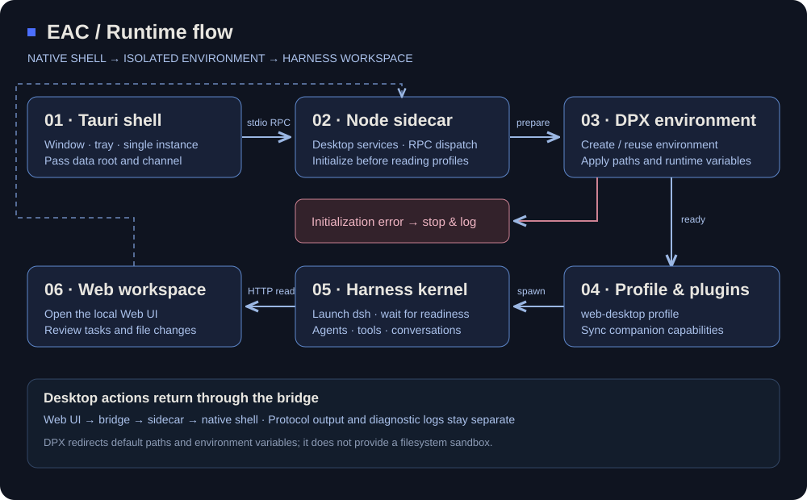

<div align="center">

<h1></h1>

**_EAC = Embracing All Creation（揽尽万象）_**

[中文](README.md) | [English](README.en.md)

[](https://github.com/DSH-EAC/EAC-Desktop)
[](LICENSE)

[](https://qm.qq.com/q/vqXxQQ3rmo)
[](https://discord.com/invite/kY48Ah8h)

[](https://trendshift.io/repositories/158075)
[](https://trendshift.io/repositories/158075)

[下载](https://github.com/DSH-EAC/EAC-Desktop/releases) · [快速开始](#快速开始) · [架构设计](#架构设计) · [社区支持](#社区与支持)

</div>

**励志熔铸数百插件为一。**

Deepseek Harness EAC 是基于 [DeepSeek Harness](https://github.com/deepseek-ai/deepseek-harness) 的开源第三方桌面插件整合工作台

**EAC · Embracing All Creation · 揽尽万象。** 开放的是能力，清晰的是边界：桌面壳负责体验，服务层负责运行，Harness 内核负责 Agent，扩展包负责更多可能。

## 核心能力

| 从需求到行动 | EAC 提供的能力 |
| --- | --- |
| 打开就能工作 | 随包准备 Node.js、npm 与 dsh 运行资源，启动本地 Web UI；普通使用无需单独安装 Node.js |
| 围绕项目协作 | 在工作目录中发起任务，查看会话文件变更，并通过文件视图检查与还原修改 |
| 长任务保持上下文 | 请求路径上的上下文压缩与有界溢出恢复，为持续对话管理上下文空间 |
| 配置自己的工作方式 | 通过快速配置入口管理视觉模型与人设相关设置，按任务需求组织工具能力 |
| 扩展保持可管理 | 聚合插件目录、安装与启停入口，配合保护中心的快照、体检和回滚能力 |
| 环境各自独立 | 通过 DPX 管理环境身份、默认数据路径与运行时变量，按发布通道分离环境 |
| 桌面融入日常 | Tauri 原生窗口、托盘、单实例与退出策略，配合进程编排管理服务生命周期 |
| 外观按需组合 | 用户皮肤通过市场包接入；桌面宿主与皮肤资源以明确契约协作 |

模型调用由配置的提供商完成。插件的启用状态、兼容范围与附加依赖由具体发行包和插件配置决定。

## 快速开始

### 下载与启动

Windows 最新稳定版：**v6.0.0**。其余平台按包格式列出最近发布的下载文件，版本分别标注。

| 平台 | 版本 | 直接下载 | 更新时间（北京时间） |
| --- | --- | --- | --- |
| Windows x64 | v6.0.0 | [Full Setup](https://github.com/DSH-EAC/EAC-Desktop/releases/download/v6.0.0/Deepseek-Harness-EAC-full-v6.0.0-Setup-x64.exe) | 2026-10-05 |
| Windows x64 | v6.0.0 | [Lite Setup](https://github.com/DSH-EAC/EAC-Desktop/releases/download/v6.0.0/Deepseek-Harness-EAC-lite-v6.0.0-Setup-x64.exe) | 2026-10-05 |
| Linux x64 | v5.3.6 | [AppImage](https://github.com/DSH-EAC/EAC-Desktop/releases/download/v5.3.6/Deepseek.Harness.EAC_5.3.6_amd64.AppImage) | 2026-09-03 |
| Linux x64 | v5.3.6 | [deb](https://github.com/DSH-EAC/EAC-Desktop/releases/download/v5.3.6/Deepseek.Harness.EAC_5.3.6_amd64.deb) | 2026-09-03 |
| macOS arm64 | v5.1.0 | [dmg](https://github.com/DSH-EAC/EAC-Desktop/releases/download/v5.1.0/Deepseek.Harness.EAC_5.1.0_macos-arm64.dmg) | 2026-08-27 |

[发布说明](https://github.com/DSH-EAC/EAC-Desktop/releases/tag/v6.0.0) · [SHA256SUMS.txt](https://github.com/DSH-EAC/EAC-Desktop/releases/download/v6.0.0/SHA256SUMS.txt)


<details>
<summary>校验下载文件</summary>

在 PowerShell 中计算文件摘要，将结果与同一 Release 的校验清单对照：

```powershell
Get-FileHash -LiteralPath '<下载文件路径>' -Algorithm SHA256
```

</details>

## 架构设计

**一个桌面入口，三层明确分工。** EAC 将操作系统集成、运行编排与 Agent 内核分离，让桌面体验与扩展能力各自演进。



| 层次 | 职责 | 代码入口 |
| --- | --- | --- |
| **L1 · 原生桌面** | 窗口、托盘、单实例、退出策略与原生集成 | [Rust shell](tauri-shell/src/main.rs) |
| **L2 · 运行编排** | 环境初始化、profile、进程启动、桌面 RPC、插件同步与治理 | [Node sidecar](tauri-shell/sidecar/server.ts)、[桌面服务](dsh-desktop/lib/desktop) |
| **L3 · Harness 内核** | Agent 执行、对话、工具、Cordis 插件树与 Web UI | [内核依赖](dsh-desktop/package.json) |
| **DPX · 环境基础设施** | 环境注册、目录布局、默认路径与运行时变量 | [环境适配层](dsh-desktop/lib/desktop/environment.ts)、[dsh-dpx](third_party/dsh-dpx) |

### 从双击到执行

1. **桌面壳定位资源并启动 sidecar**，传入产品数据根与通道信息。
2. **DPX 建立或复用环境**，在读取用户配置与插件模块前应用运行时变量。
3. **服务层准备 profile 与配套插件**，启动 dsh 并等待服务就绪。
4. **主窗口进入 Web UI**，由 Harness 承担会话与工具执行；桌面操作通过桥接层交给宿主。

Rust 与 Node 使用 **stdio JSON-RPC** 通信，协议输出与诊断日志分开。环境初始化失败会中止启动并记录错误，避免在错误的数据根中继续运行。

### 让复杂性留在明确的边界里

- **桌面集成不承包业务。** 原生能力留在 L1，业务服务放在 L2，扩展优先通过插件契约接入。
- **环境管理复用成熟实现。** DPX 负责注册表、环境身份与默认路径；EAC 通过适配层调用，避免重复维护两套规则。
- **分发以实际装配为准。** 插件目录、同步清单与依赖工件共同组成发行包，资源缺失在装配阶段暴露。
- **界面资源有可核对的来源。** UI skin manager 与默认壳资源通过锁文件固定工件，并在装配时校验 SHA-256。

阅读 [三层边界](docs/adr/0002-shell-boundary-and-layering.md)、[环境隔离](docs/adr/0004-eac-install-environment-isolation.md) 与 [本体范围](docs/adr/0006-minimal-core-scope.md)，了解设计约束。

## 插件与外观

### 桌面配套能力

配套插件沿 Harness 的 host / client 契约接入。以下模块由 [资源装配脚本](tauri-shell/stage-resources.mjs) 组织分发：

| 模块 | 插件 | 作用 |
| --- | --- | --- |
| 文件协作 | `dsh-file-changes`、`dsh-client-file-changes` | 会话文件变更投影、变更视图与还原入口 |
| 上下文管理 | `dsh-compact` | 请求路径压缩与有界溢出恢复 |
| 快速配置 | `dsh-easy-setup` | 视觉模型、人设与相关配置入口 |
| 插件发现 | `dsh-unified-market` | 聚合目录与安装管理 |
| 插件保护 | `dsh-plugin-shield` | 快照、体检与回滚入口 |
| 语言兼容 | `dsh-eac-locale-compat` | 配套及社区插件的英文界面兼容 |
| 界面稳定 | `dsh-viewport-lock`、`dsh-settings-scroll-fix` | 视口约束、设置面板滚轮与溢出滚动修复 |

### 扩展分发

插件采用 **builtin / recommended / external** 分级：随包能力由装配清单定义，推荐集合与外部插件由各自包元数据定义。按功能选择扩展，也按来源、版本约束和许可管理扩展。

开发者可通过 [分发规范](docs/adr/0008-plugin-distribution-boundary.md)、[插件账本](.sync/plugin-distribution.json) 与 [来源记录](dsh-desktop/assets/SOURCES.json) 查阅接入规则和组件归属。

### 皮肤契约

用户 Web UI 皮肤通过市场按需安装，未激活皮肤时使用宿主原生外观。壳层的 UI skin manager 与 `system.default` 资源由 [工件锁](tauri-shell/skin-manager-artifact.lock.json) 管理；区域、插槽与可用能力由 [host profile](tauri-shell/host-profile.json) 定义。

**皮肤负责呈现，宿主负责能力与窗口边界。** 两者通过契约协作，减少界面定制与业务逻辑的相互侵入。

## 数据与环境

EAC 使用 **DPX 独立环境**组织桌面数据，桌面 profile 为 `web-desktop`。环境按 `eac-<channel>` 命名，同一通道复用环境，不同通道分开存储。

```text
<产品数据根>/
└── dpx/dsh-environments/eac-<channel>/
    ├── .dpx-environment.json      # 环境身份
    ├── dsh-home/                 # profile、会话、skills 与配置
    ├── home/                     # 环境内用户目录
    ├── appdata/                  # 应用数据
    ├── localappdata/             # 本地应用数据
    ├── tmp/                      # 临时文件
    └── workspace/                # 环境工作目录
```

Windows 默认产品数据根为 `%LOCALAPPDATA%\Deepseek Harness EAC`；其他平台按系统数据目录推导。宿主 `~/.dsh` 仅做检测与提示，不自动迁移、删除或覆盖。

备份时先退出应用，保存实际产品数据根与单独的项目目录。便携包描述的是程序分发方式，数据位置由环境配置决定。

DPX 收容默认路径与环境变量，**不提供文件系统沙箱隔离**；进程对显式绝对路径的访问仍由操作系统权限控制。实现细节见 [environment.ts](dsh-desktop/lib/desktop/environment.ts)。

## 开发指南

### 工程导航

```text
tauri-shell/       Rust 壳、sidecar、桥接、资源装配与打包
dsh-desktop/       TypeScript 服务、配套插件、构建脚本与测试
third_party/       固定提交的外部依赖
.sync/             插件来源、分发与同步账本
docs/adr/          架构决策与模块边界
```

构建矩阵覆盖 Windows / Linux 的 x64 与 arm64；仓库同时提供 macOS 平台配置。平台安装包从 Releases 获取，源码构建参考 [安装包工作流](.github/workflows/staged-runtime-artifact.yml)。

<details>
<summary>准备源码与工具链</summary>

使用 Git、Node.js 24、pnpm 11.7.0 与 Rust stable。Windows 需要对应 Rust 目标的 C++ 构建工具；Linux 需要 Tauri / WebKitGTK 依赖。

```sh
git clone --recurse-submodules https://github.com/says693/Deepseek-Harness-EAC.git
cd Deepseek-Harness-EAC
git submodule update --init --recursive
node tauri-shell/check-dpx-pin.mjs
npm install --global pnpm@11.7.0

cd dsh-desktop
node scripts/fetch-kernel.js
npm run ci:install
npm run typecheck
npm run build
npm run fetch-runtime
npm test
cd ..
```

内核依赖使用本地 `vendor/kernel` 工件，先获取固定内核再安装依赖。构建过程需要联网获取依赖。

</details>

<details>
<summary>装配与打包</summary>

Windows，在仓库根目录执行：

```sh
node tauri-shell/stage-resources.mjs --target=win32 --skip-npm
node dsh-desktop/scripts/verify-staged-runtime.mjs
cd tauri-shell
cargo fetch --locked
npx -y @tauri-apps/cli@2 build --verbose
```

Linux 使用 `--target=linux`，构建时设置 `APPIMAGE_EXTRACT_AND_RUN=1`。Ubuntu 构建环境需要：

```sh
sudo apt-get update
sudo apt-get install -y libwebkit2gtk-4.1-dev libappindicator3-dev librsvg2-dev patchelf libfuse2 rpm
```

便携包装配见 [make-portable.mjs](tauri-shell/make-portable.mjs)。

</details>

<details>
<summary>验证与贡献</summary>

在 `dsh-desktop` 目录执行类型检查、测试与插件账本检查：

```sh
npm run typecheck
npm test
node scripts/plugin-ledger.mjs
node scripts/plugin-sync.mjs validate
```

启动、桥接、环境与打包修改还需对应运行验证。按 [开发指南](.agents/skills/deepseek-harness-eac-dev/SKILL.md) 选择检查范围，按 [贡献规范](CONTRIBUTING.md) 提交修改。

</details>

## 文档与社区

- [架构决策](docs/adr)：分层、隔离、皮肤与插件分发设计。
- [问题反馈](https://github.com/DSH-EAC/EAC-Desktop/issues)：缺陷复现、功能建议与使用反馈。
- [参与贡献](https://github.com/DSH-EAC/EAC-Desktop/pulls)：代码、插件兼容、平台支持与文档改进。
- [贡献者](https://github.com/DSH-EAC/EAC-Desktop/graphs/contributors)：共同构建 EAC 的开发者。
- [生态致谢](docs/ECOSYSTEM-CREDITS.md)：插件作者、皮肤来源与许可记录。

反馈问题时请附应用版本、操作系统、包类型、复现步骤和经过脱敏的日志，便于定位环境与运行链路。

## 社区与支持

欢迎交流使用技巧、插件开发与问题排查。

| 渠道 | 入口 |
| --- | --- |
| QQ | [1083832019](https://qm.qq.com/q/vqXxQQ3rmo) |
| Discord | [DSH-EAC](https://discord.com/invite/kY48Ah8h) |
| 问题反馈 | [GitHub Issues](https://github.com/DSH-EAC/EAC-Desktop/issues) |

<table><tr><td align="center"></td><td align="center"></td></tr><tr><td align="center">QQ · 1083832019</td><td align="center">微信交流群</td></tr></table>

## 贡献者与致谢

感谢为 EAC 的代码、平台支持、插件生态与文档投入时间的开发者。

<table>
<tr>
<td align="center" width="25%"><a href="https://github.com/Ebony-Vinyl"><br />Ebony-Vinyl</a></td>
<td align="center" width="25%"><a href="https://github.com/metaone01"><br />metaone01</a></td>
<td align="center" width="25%"><a href="https://github.com/jing-hy"><br />jing-hy</a></td>
<td align="center" width="25%"><a href="https://github.com/zixin947"><br />zixin947</a></td>
</tr>
<tr>
<td align="center" width="25%"><a href="https://github.com/says693"><br />says693</a></td>
<td align="center" width="25%"><a href="https://github.com/dtyg123"><br />dtyg123</a></td>
<td align="center" width="25%"><a href="https://github.com/lanyun077"><br />lanyun077</a></td>
<td align="center" width="25%"><a href="https://github.com/BAIKAI23333"><br />BAIKAI23333</a></td>
</tr>
<tr>
<td align="center" width="25%"><a href="https://github.com/nishantpurohit04"><br />nishantpurohit04</a></td>
<td align="center" width="25%"><a href="https://github.com/ViscaOwO"><br />ViscaOwO</a></td>
<td align="center" width="25%"><a href="https://github.com/jiang8297"><br />jiang8297</a></td>
<td align="center" width="25%"><a href="https://github.com/Luoye-hb"><br />Luoye-hb</a></td>
</tr>
<tr>
<td align="center" width="25%"><a href="https://github.com/look-back-lysj"><br />look-back-lysj</a></td>
<td align="center" width="25%"><a href="https://github.com/T-Auto"><br />T-Auto</a></td>
<td align="center" width="25%"><a href="https://github.com/maliang233"><br />maliang233</a></td>
<td align="center" width="25%"><a href="https://github.com/lbn2011"><br />lbn2011</a></td>
</tr>
</table>

特别感谢 [@Nuomi9](https://github.com/Nuomi9) 对 macOS 桌面移植的贡献（[PR #234](https://github.com/DSH-EAC/EAC-Desktop/pull/234)）。插件作者与皮肤来源详见 [生态致谢名单](docs/ECOSYSTEM-CREDITS.md)。

## 许可与致谢

EAC 使用 [MIT License](LICENSE)。感谢 [DeepSeek Harness](https://github.com/deepseek-ai/deepseek-harness)、[dsh-dpx](https://github.com/T-Auto/dsh-dpx)、Tauri，以及所有插件、皮肤、平台与文档贡献者。

第三方组件保留各自版权与许可。皮肤来源中包含 CC BY-NC-SA 4.0 内容，使用与再分发须遵守对应组件的许可条款。

---

<div align="center"><sub>Embracing All Creation · 精简本体，容纳更多可能。</sub></div>
