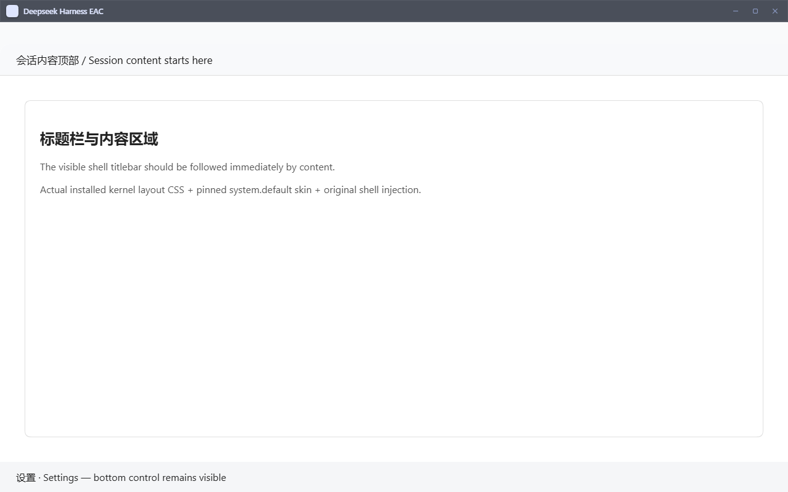
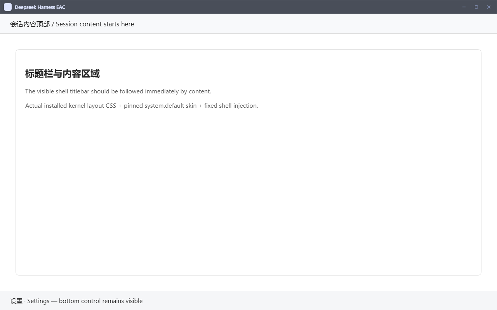
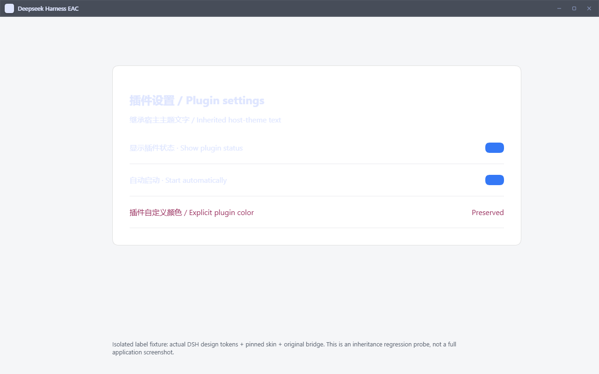
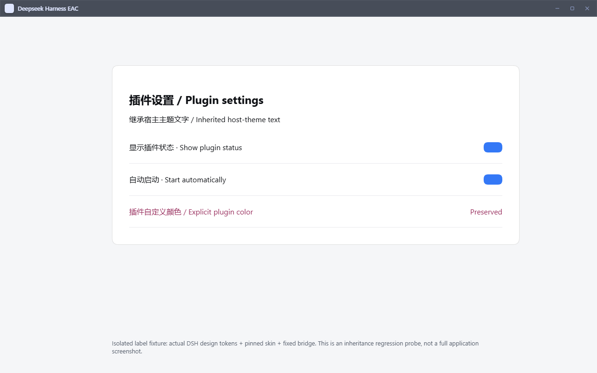

# v6 便携版问题逐项处理记录

原始测试包：`Deepseek-Harness-EAC-full-v6.0.0-x64-portable.zip`。本次针对当前源码和已安装插件兼容性修复；源码基线为 `54790b5`，内核为 `0.2.0-rc.2`。原始反馈、全部截图和视频保存在 [reported/README.md](reported/README.md)，便于移除根目录临时 `BUG/` 后继续追踪。

## 问题与处理

| 原始问题 | 本次处理 | 结论及后续复现条件 |
| --- | --- | --- |
| 1. wallpaper-engine 吉祥物与顶栏冲突 | 修复壳和固定皮肤重复预留的 36px；保留内核标题栏标记和拖动区。 | 公共布局原因已修复。wallpaper-engine 自己的吉祥物边界仍需报告时的插件版本、配置和原便携包复现，不能由布局探针推断全部修复。 |
| 2. 工作区权限浮窗异常 | 用当前内核真实 `PermissionSelect`、React、Menu 和 RiskConfirmation 做隔离验证：指针移动/选择、Enter/方向键/Escape、焦点恢复、外部点击、portal、防裁切、完全权限确认取消均通过。 | 当前组件未复现，未加推测性补丁。原视频所属界面需提供当时插件清单及版本；隔离测试没有修改真实权限。 |
| 3. 顶栏重复灰色空间 | Windows 壳范围内清除固定皮肤额外 body padding；frame 的 height/max-height 恢复 100%，由内核只预留一次 36px。 | 浏览器测量内容和 resize handle 的顶部从 72px 降为 36px，底部控件保持可见。小、普通、大视口及重新加载验证通过；固定皮肤包未修改。 |
| 4. 桌宠占用大、越界、关不掉、卸载无效 | 兼容旧消费者的 `rows`，保留 `list`；解析包声明的 YAML，包名和 loader ID 分离，启停作用于所有真实条目；外部卸载交给内核包事务。 | 启停和卸载的公共兼容层已修复并回归。独立桌宠几何不在当前内置源码中；需要原 `dsh-pet` / wallpaper-engine 版本确认归属。未恢复已退役桌宠。 |
| 5. 通用设置首次默认收起 | 查明截图中的旧设置分组插件已退出当前核心分发。 | 待旧版 `dsh-settings-groups` 或提供该分组界面的准确包版本复现，不宣称已修复。 |
| 6. 增强功能/余额文字不清、关闭残留、重复开关 | DSH root 和 portal dialog 边界继承当前主题文字 token；保留插件显式颜色。默认禁用、市场切换共享真实条目解析。退役清理只处理有 EAC 来源标记的副本，失败可重试。 | 字色继承和公共状态层已修复。旧 `dsh-feature-toggles`、`dsh-whale-widget`、余额插件的重复开关及具体残留表现需原包版本复现。社区自行重装的同名包保留。 |
| 7. 桌宠设置字色及关闭失败 | 同第 4、6 项，覆盖 body 外 dialog、旧 `rows` 消费者、`dsh-pet` 包名对应 `pet` 等不同 loader ID 的情形。 | 公共兼容问题已修复；旧 `dsh-pet-settings` 本身需准确版本进行整体验收。 |
| 8. 插件管理命令乱码 | 根因是便携包缺少 pnpm，Windows 的找不到命令错误被展示为乱码。固定打包 `pnpm@11.7.0`，由随包 Node 调用 JS 入口；统一 EAC CLI launcher 向选定内核 `runCli()` 传入 packageManager。 | 无全局 Node/npm/pnpm 的隔离流程通过 inspection/install/uninstall 和 lockfile 验证，路径含空格与中文。缺少资源明确报错，不回退全局命令。其他来源的编码问题不作扩大结论。 |

## UI 前后证据

以下是浏览器隔离探针，使用真实内核 CSS、固定皮肤和原版/修复后壳注入，不是完整解压应用验收截图。

| 标题栏修复前 | 标题栏修复后 |
| --- | --- |
|  |  |

1280×800 视口：标题栏 `[0,36]` 保持不变，内容及 resize handle 从 `[72,800]` 变为 `[36,800]`，底部控件仍为 `[751,800]`。

| 文字继承修复前 | 文字继承修复后 |
| --- | --- |
|  |  |

真实浅色 token 下标签从 `rgb(223,230,255)` 变为 `rgb(15,17,21)`；插件显式颜色始终为 `rgb(148,38,87)`。回归还覆盖深色、动态插入 dialog、皮肤替换、shell 页面/标题栏/退出层排除。

当前权限组件验证：[菜单与 portal](evidence/current-permission-menu-open.png)、[完全权限确认](evidence/current-permission-confirmation.png)。菜单位于独立 portal，没有被带 overflow 的父容器裁切；选择回调只写内存。

## 实现边界

- L1 只修正 Windows 壳布局；L2 负责启动、随包包管理器、状态治理及退役清理；市场调用共同的包身份解析。
- `dshBin()` 仍返回实际选中的内核（包括 overlay），另用 `dshCli()` 返回 launcher。市场子进程保留两者。
- YAML 注释、多个入口、scoped 包、父级共享 node_modules 均被覆盖；动态/缺失/冲突身份拒绝写入猜测覆盖。
- 包开关保留 bundle 注册；显式 `disabled: false` 可覆盖包默认禁用。市场更新保留用户选择，卸载不再重新制造猜测的 patch 行。
- 退役操作要求有效复制标记及匹配身份，保留社区包、链接及本地安装。配置、manifest、settings 写失败及目录锁定都不记录完成；下次启动重试。相同 ID 出现在其他插件嵌套配置中不会被删除。
- launcher 不添加跳过构建审核、禁用 lockfile 或绕过内核兼容/回滚检查的参数。未修改固定皮肤包和上游内核源码。

## 验证记录（2026-10-06）

- TypeScript build：通过。
- Skill 分类器：`ready`，最低验证 `package`，无未覆盖代码和缺失测试路径；保留 fail-fast。
- Skill 自检：通过；PowerShell 7 与 Windows PowerShell 5.1 的分类/失败阻断回归各 21 项通过（警告：可选 Python 校验器缺 PyYAML、当前 workflow 没有覆盖 Skill 的 paths 过滤）。
- 完整 Node 套件：390 项，386 通过、3 失败、1 跳过。三个失败均引用 `origin/main` 在 `0a628ae` 删除的 `.github/workflows/ci.yml`：`ci-workflow`、`eac-ci-fail-fast`、`stage-7-canonical-source`。没有恢复已删除工作流或屏蔽测试。
- 相关回归：包身份、市场切换、旧 API、随包 pnpm、退役重试及嵌套配置保护通过；修正后的退役/分级/内核来源定向集 38/38。
- Windows Edge 浏览器布局/主题探针 3/3；当前权限真实组件的隔离交互验证通过。
- `cargo check --locked --offline`：通过。
- `cargo build --locked --offline`：通过；将生成的原生 EXE 放入 staged 目录，在隔离数据目录执行 `--bridge-test`，3/3 通过。
- `cargo test --locked --offline`：21 通过、1 失败。未改动的 `died_page_exposes_environment_diagnosis_and_guarded_purge` 固定断言中文文案，但页面按本机系统语言输出英文；保留测试并明确记录。
- 资源装配与 `verify-staged-runtime.mjs`：通过，41 个必需文件、9 类退役路径检查、646 个生产包；包含 launcher、pnpm 的 JS 入口及实现文件、共用身份解析。
- 真实随包 Node 24.19.0 + pnpm 11.7.0：只有 Windows System32 在测试 PATH；本地 tarball 安装/卸载、内核包信息查询（本地测试 registry）、lockfile 创建均通过，profile 路径含空格和中文。overlay launcher 与市场重新调用另有回归测试。
- 隔离 staged boot：首次 60 秒超时；补全工作树的内核缓存后再次执行通过，鉴权 303→200、退出后 HTTP 服务消失。停止时记录等待进程退出超时后强制回收；不宣称优雅退出已验证。

**分发验收为 partial。** 未完成最终便携 zip 解压后的原生 GUI、真实 OS 最大化、安装器、全部第三方插件原版本组合验收。PR 保持 draft；本记录中的浏览器大视口不等同于原生最大化。

## 回退与资料保留

代码可通过回退本 PR 恢复。没有读取或迁移用户正在使用的 profile、会话或凭据，验证均使用临时目录。退役清理会删除可识别的旧 EAC 副本；若需恢复其功能，应从市场安装兼容版本。原始 `BUG/` 的 14 个文件在 `reported/` 留档：图片/视频字节不变，README 仅规范化行尾空白；另有本地原始 ZIP 备份。临时根目录仅在 PR 已发布且资料核对后删除。
