# 实测 “ECA-DESKTOP” BUG汇总

> 测试项目：Deepseek-Harness-EAC-full-v6.0.0-x64-portable.zip（以下均提**EAC-Desktop**）

## 一、主页问题

### dsh-plugin-wallpaper-engine冲突

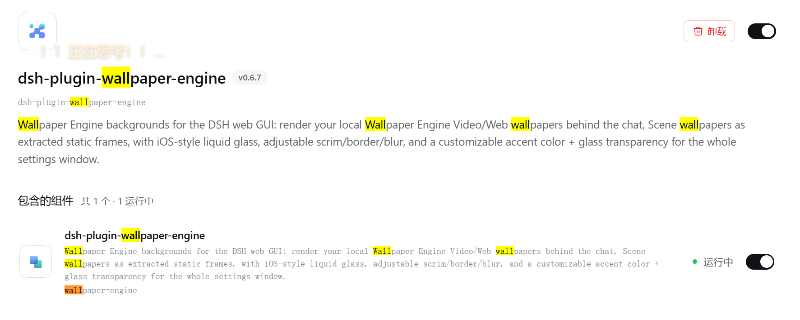

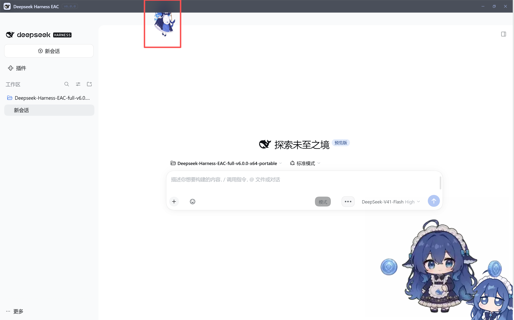

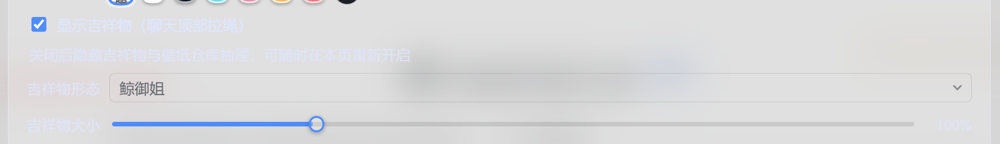

> 大致情况应当是`dsh-plugin-wallpaper-engine`的`吉祥物`是使用浏览器顶端判定，而**EAC-Desktop**的壳封装覆盖了一部分顶栏界面[详见《顶栏问题》](#顶栏问题)

### 工作区权限浮窗问题

此处应有一段video ↓ ↓ ↓（若看不到请移步`video/2026-10-05 18-00-38.mp4`
<video controls width="500">
  <source src="./video/2026-10-05%2018-00-38.mp4" type="video/mp4">
</video>

> 看不懂……应该是自定义界面没做好判定

### 顶栏问题

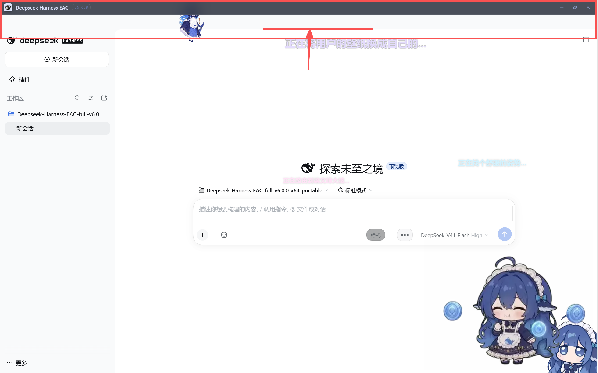

> [解决此问题就能解决wallpaper问题（大概）](#dsh-plugin-wallpaper-engine冲突)；此项问题大概是壳封装的问题，箭头指向的那条线的水平线就是整个顶部栏的下边缘（所以你可以拖拽这一部分灰色栏让整个窗口动起来），值得一提的是，我曾触发过没有这部分灰色栏的状态，即实际下边缘和视觉下边缘顺利重合了。目前的状态是实际顶栏又叠加了一个壳的顶栏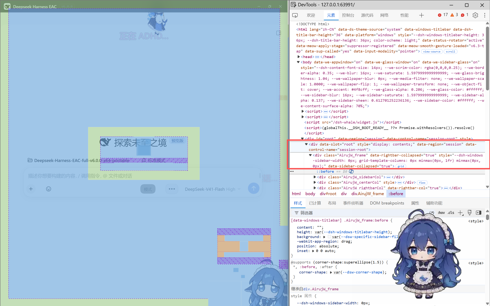
> 可以着重看一下`class="AirujW_frame"`

### 桌宠问题（大概率是`dsh-pet`）

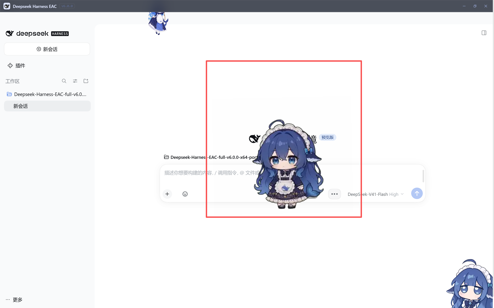

> 1.占用范围太大；2.会超出**EAC-Desktop**窗口外；3.如果这个是`dsh-pet`，那么还有一些问题：关不掉、卸载插件无效（关闭之后还是显示，卸载之后还是显示

## 二、设置问题

### 通用设置

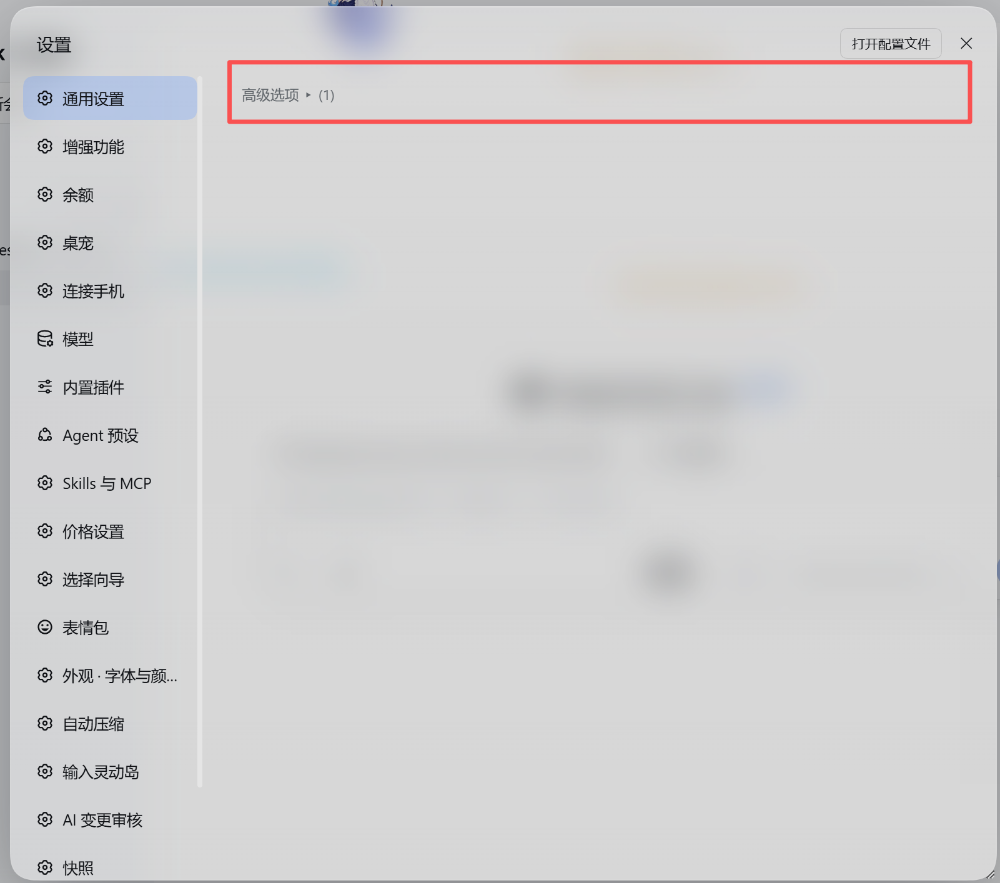

> **初次打开**，通用设置这边是**收起**的（至少我是这样

### 增强功能&余额

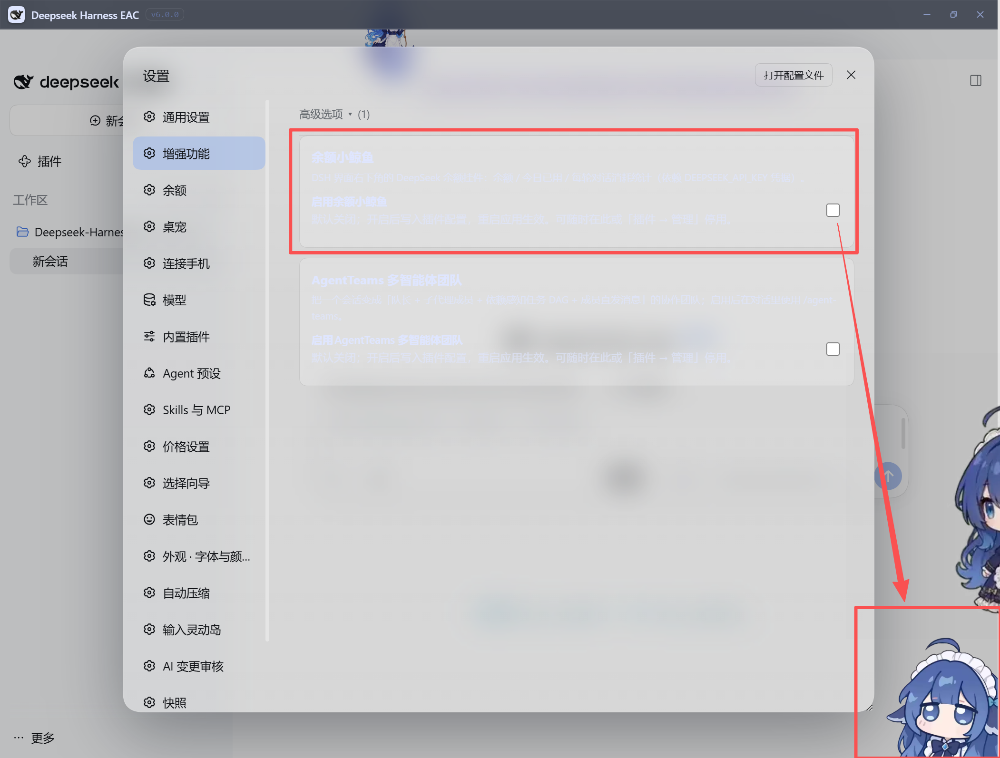

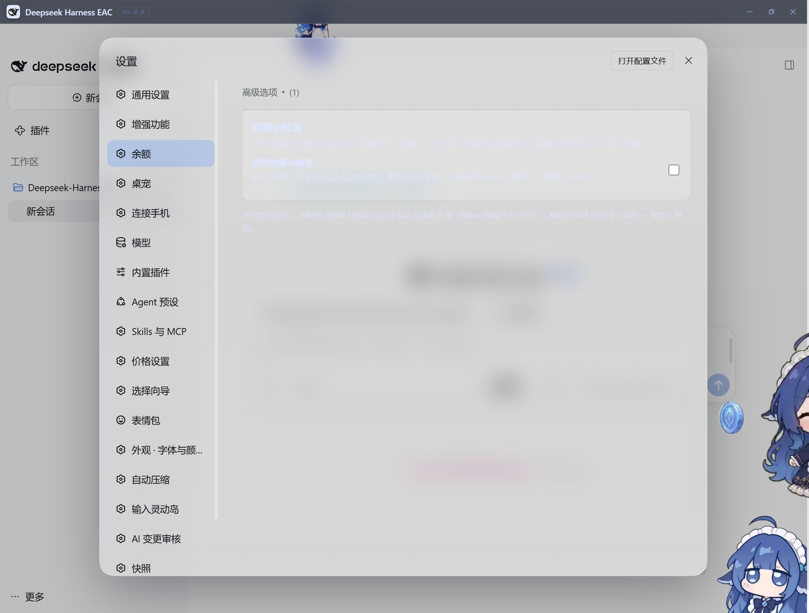

> 1.**字体**看不清（无任何设置，仅初次打开）；2.关闭后**依旧还在**（初始是没有的，后来我打开了又关闭了就成这样了，我确认我重启过）；3.**增强功能**和**余额**设置冲突了

### 桌宠（`dsh-pet`）

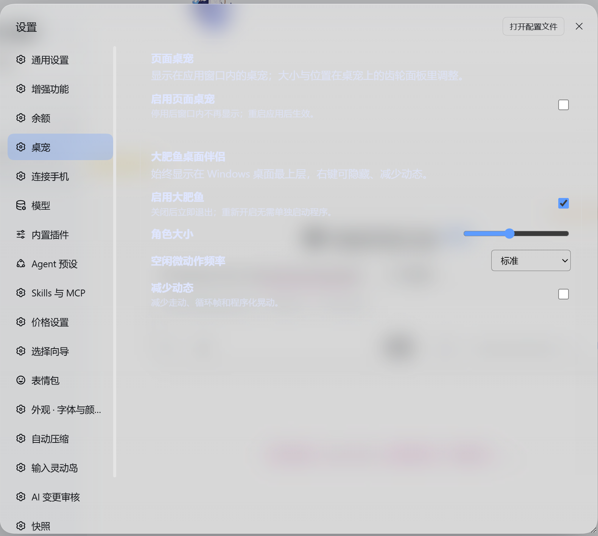

> 设置通用毛病，看不清字；然后前面提到`dsh-pet`关不掉

## 三、插件管理

### 命令乱码

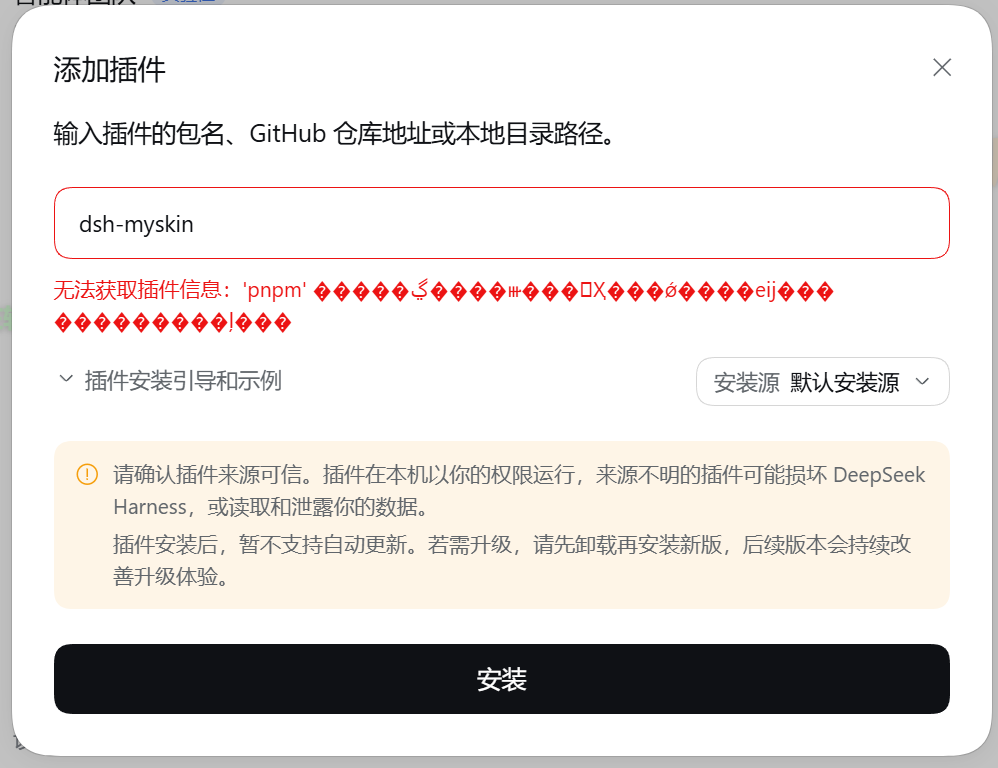
